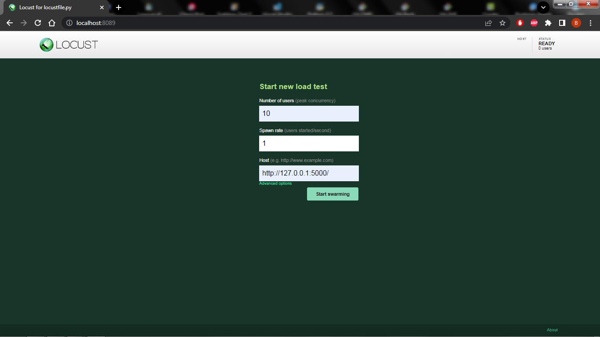
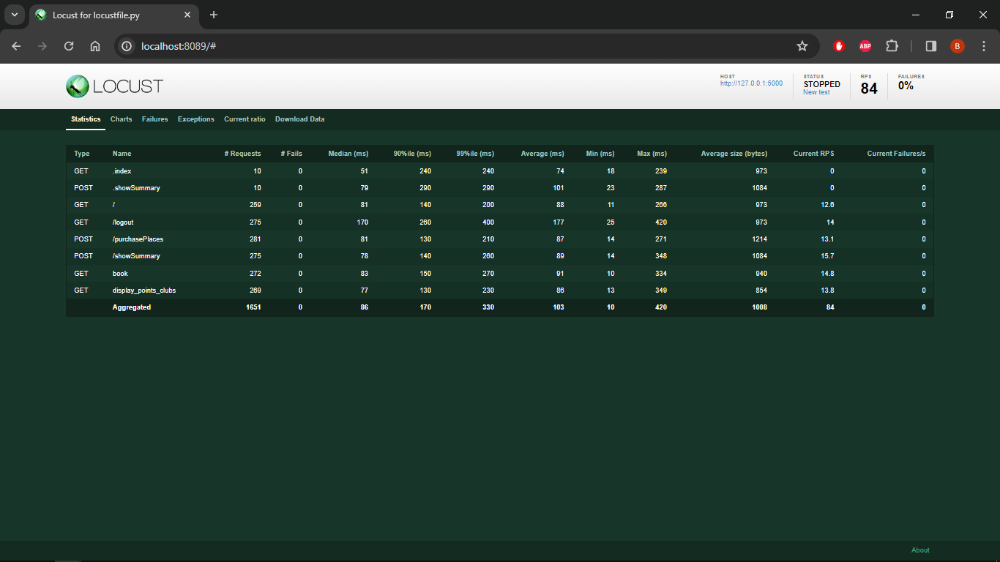

    
   
   
   

   
   
    

<div id="top"></div>

## Menu   

1. **[Informations générales](#informations-générales)**   
2. **[Fonctionnalités](#fonctionnalités)**   
3. **[Liste pré-requis](#liste-pre-requis)**   
4. **[Création environnement](#creation-environnement)**   
5. **[Activation environnement](#activation-environnement)**   
6. **[Installation des librairies](#installation-librairies)**   
7. **[Exécution de l'application](#execution-application)**   
8. **[Tests et couverture de code](#tests-et-couverture-de-code)**   
9. **[Tests unitaires](#tests-unitaires)**   
10. **[Tests d'intégrations](#tests-integrations)**   
11. **[Tests fonctionels](#tests-fonctionels)**   
12. **[Tests de performances avec Locust](#tests-performances)**   
13. **[Tests de couverture de code avec Coverage](#tests-coverage)**
14. **[Rapport avec flake8](#rapport-flake8)**   
15. **[Informations importantes sur les différents fichiers et dossiers](#informations-importantes)**   
16. **[Auteur et contact](#auteur-contact)**   


<div id="informations-générales"></div>

<div style="display: flex; align-items: center;">
    <h3>Projet Gudlft</h3>
    
</div>

- Application destinée à la réservation d'événements sportifs.   
- L'objectif de ce projet est d'apporter des corrections aux fonctions existantes et d'implémenter de nouvelles fonctions.   
- Effectuer un processus de test avec **Pytest** et **Locust**.   

Plusieurs domaines de l'application **Gudlft** ont été améliorés à partir du projet forker et cloner à l'adresse suivante :   
➔ [Python_Testing](https://github.com/OpenClassrooms-Student-Center/Python_Testing)   

--------------------------------------------------------------------------------------------------------------------------------

. __Correction des erreurs__   

   - ``ERROR`` : Entering a unknown email crashes the app   
   - ``BUG`` : Clubs should not be able to use more than their points allowed   
   - ``BUG`` : Clubs shouldn't be able to book more than 12 places per competition   
   - ``BUG`` : Booking places in past competitions   
   - ``BUG`` : Point updates are not reflected   
   - ``FEATURE`` : Implement Points Display Board   

. __Amélioration des fonctionnalités__   

  ```python   
  def loadClubs():
  def loadCompetitions():
  def index():
  def showSummary():
  def book():
  def purchasePlaces():
  ```   

. __Création des fonctionnalités__   

  ```python   
  def load_mock_clubs():
  def load_mock_competitions():
  def display_points_clubs():
  ```   

--------------------------------------------------------------------------------------------------------------------------------

<div id="fonctionnalités"></div>
<a href="#top" style="float: right;">Retour en haut 🡅</a>

### Fonctionnalités   

- Opérations de réservation pour les événements disponibles sur l'application.   
- Visualisation des clubs et du nombre de points.   

>_**Note :** Testé sous **Windows 10** Professionnel - **Python** 3.12.0 - **Flask** 3.0.0_   

--------------------------------------------------------------------------------------------------------------------------------

<div id="liste-pre-requis"></div>
<a href="#top" style="float: right;">Retour en haut 🡅</a>

### Liste pré-requis   

- Interpréteur **Python**, version 3.12 ou supérieure   

Application conçue avec les technologies suivantes :   

- **Python** v3.12.0 choisissez la version adaptée à votre ordinateur et système.   
- **Python** est disponible à l'adresse suivante ➔ https://www.python.org/downloads/   
- **Flask** version 3.0.0 ➔ [Documentation Flask](https://flask.palletsprojects.com/en/3.0.x/)   
- **Windows 10** Professionnel   
  &nbsp;   

- Les scripts **Python** s'exécutent depuis un terminal.   
- Pour ouvrir un terminal sur Windows, pressez la touche ``windows + r`` et entrez ``cmd``.   
- Sur **Mac**, pressez la touche ``command + espace`` et entrez ``terminal``.   
- Sur **Linux**, vous pouvez ouvrir un terminal en pressant les touches ``Ctrl + Alt + T``.   

--------------------------------------------------------------------------------------------------------------------------------

<div id="creation-environnement"></div>
<a href="#top" style="float: right;">Retour en haut 🡅</a>

### Création de l'environnement virtuel   

- Installer une version de **Python** compatible pour votre ordinateur.   
- Une fois installer ouvrer **le cmd (terminal)** placer vous dans le dossier principal **(dossier racine)**.   

Taper dans votre terminal :   

```bash   
$ python -m venv env
```   

Un répertoire appelé ``env`` doit être créé.   

--------------------------------------------------------------------------------------------------------------------------------

<div id="activation-environnement"></div>
<a href="#top" style="float: right;">Retour en haut 🡅</a>

### Activation de l'environnement virtuel   

- Placez-vous avec le terminal dans le dossier principale **(dossier racine)**.   

Pour activer l'environnement virtuel créé, il vous suffit de taper dans votre terminal :   

```bash   
$ env\Scripts\activate.bat
```   

- Ce qui ajoutera à chaque début de ligne de commande de votre terminal ``(env)`` :   
>_**Note :** Pour désactiver l'environnement virtuel, il suffit de taper dans votre terminal :_   

```bash   
$ deactivate
```   

--------------------------------------------------------------------------------------------------------------------------------

<div id="installation-librairies"></div>
<a href="#top" style="float: right;">Retour en haut 🡅</a>

### Installation des librairies   

- Le programme utilise plusieurs librairies externes et modules de **Python**, qui sont répertoriés dans le fichier ``requirements.txt``.   
- Placez-vous dans le dossier où se trouve le fichier ``requirements.txt`` avec le terminal, l'environnement virtuel doit être activé.   
- Pour faire fonctionner le programme, il vous faudra installer les librairies requises.   
- À l'aide du fichiers ``requirements.txt`` mis à disposition.   

Taper dans votre terminal la commande :   

```bash   
$ pip install -r requirements.txt
```   

--------------------------------------------------------------------------------------------------------------------------------

<div id="execution-application"></div>
<a href="#top" style="float: right;">Retour en haut 🡅</a>

### Exécution de l'application   

#### Utilisation   

Lancement du serveur **Flask**.   

- Utilisation de **Flask**. ➔ [Documentation Flask](https://flask.palletsprojects.com/en/3.0.x/)   
- Placez-vous avec le terminal dans le dossier principal.   
- Activer l'environnement virtuel et ensuite lancer le serveur **Flask**.   

Taper dans votre terminal la commande :   

```bash   
$ set FLASK_APP=server.py
```      

```bash   
$ flask run
```   

Lancement de l'application dans le navigateur de votre choix.   
Se rendre à l'adresse. ➔ http://127.0.0.1:5000/   
 
>_**Note navigateur :** Les tests ont était fait sur **Firefox** et **Google Chrome**._   

--------------------------------------------------------------------------------------------------------------------------------

<div id="tests-et-couverture-de-code"></div>
<a href="#top" style="float: right;">Retour en haut 🡅</a>

### Tests et couverture de code   

- Nous effectuons des tests de plusieurs manières pour garantir la qualité du code.   

>_**Note :** Pour exécuter les tests il est nécessaire d'avoir activer l'environnement virtuel, mais il n'est pas nécessaire de lancer le serveur **Flask**._    

#### Exécution de Pytest   

- Utilisation de **Pytest**. ➔ [Documentation Pytest](https://docs.pytest.org/)   
- Pour exécuter les tests à l'aide de **Pytest**, utilisez la commande suivante :   

```bash   
$ pytest -v
```   

```bash   
tests\functional_tests\test_server_functional.py                                              [11%]
tests\integration_tests\test_server_points_table.py                                           [14%]
tests\integration_tests\test_server_purchase_places.py                                        [45%]
tests\unitary_tests\test_server_book.py                                                       [50%]
tests\unitary_tests\test_server_exception.py                                                  [64%]
tests\unitary_tests\test_server_loading_json.py                                               [80%]
tests\unitary_tests\test_server_login.py                                                      [95%]
tests\unitary_tests\test_server_save_data.py                                                 [100%]

=================================== 42 passed in 97.09s (0:01:37) =================================
```   

--------------------------------------------------------------------------------------------------------------------------------

<div id="tests-unitaires"></div>
<a href="#top" style="float: right;">Retour en haut 🡅</a>

#### Tests unitaires   

- Les tests unitaires sont générés et exécutés grâce au module **Pytest**.   
- Ils sont situés dans le dossier ``tests/unitary_tests/`` ➔ ([unitary_tests](tests/unitary_tests)).   
  - ``test_server_book.py``   
  - ``test_server_exception.py``   
  - ``test_server_loading_json.py``   
  - ``test_server_login.py``   

--------------------------------------------------------------------------------------------------------------------------------

<div id="tests-integrations"></div>
<a href="#top" style="float: right;">Retour en haut 🡅</a>

#### Tests d'intégrations   

- Les tests d'intégrations sont générés et exécutés grâce au module **Pytest**.   
- Ils sont situés dans le dossier ``tests/integration_tests/`` ➔ ([integration_tests](tests/integration_tests)).   
  - ``test_server_points_table.py``   
  - ``test_server_purchase_places.py``   

--------------------------------------------------------------------------------------------------------------------------------

<div id="tests-fonctionels"></div>
<a href="#top" style="float: right;">Retour en haut 🡅</a>

#### Tests fonctionels   

- Utilisation de **Selenium**. ➔ [Documentation Selenium](https://selenium-python.readthedocs.io/)   
- Les tests fonctionels sont générés et exécutés grâce au module **Selenium**.   
- Ils sont situés dans le dossier ``tests/functionnal_tests/`` ➔ ([functional_tests](tests/functional_tests/)).   
  - ``test_server_functional.py``   
      &nbsp;   

- Les tests vérifient :   

  - le fonctionnement du serveur   
  - la navigation sur les pages   
  - la saisie de données   
  - la validation de l'affichage   

>_**Chaque méthode de test est conçue pour tester un aspect spécifique de l'application.**_   

- Les tests sont les suivants :   

```python   
1. def test_home_page(): 
# Vérifie que la page d'accueil s'affiche correctement et contient le titre attendu.   
```   

```python   
2. def test_display_points_table_clubs():
# Vérifie que la page "View clubs points" s'affiche correctement
# et affiche le message "Points available by clubs". 
```  

```python   
3. def test_login_user():
# Test le processus de connexion de l'utilisateur
# et vérifie que la page de bienvenue affiche l'adresse e-mail de l'utilisateur connecté.   
```   

```python   
4. def test_book_places_reservation_success():
# Teste le processus de réservation de places pour une compétition.
# Il simule la sélection de places, la réservation et vérifie le message de confirmation.   
```   

```python   
5. def test_book_places_reservation_success():
# Teste le processus de réservation de places pour une compétition.
# Il simule la sélection de places, la réservation et vérifie le message de confirmation.
# Ensuite, le test vérifie que les points disponibles sont mis à jour
# conformément à la réservation effectuée et que le nombre
# de places disponibles pour cette compétition est correctement réduit.   
```   

```python   
6. def test_logout():
# Teste le processus de déconnexion de l'utilisateur et vérifie que l'utilisateur est redirigé
# vers la page de connexion.   
```   

--------------------------------------------------------------------------------------------------------------------------------

<div id="tests-performances"></div>
<a href="#top" style="float: right;">Retour en haut 🡅</a>

#### Tests de performances avec Locust   

- Utilisation de **Locust**. ➔ [Documentation Locust](https://locust.io/).   
- Les tests de performances sont générés et exécutés grâce au module **Locust**.   
- Ils sont situés dans le dossier ``tests/performance_tests/`` ➔ ([performance_tests](tests/performance_tests/)).   
  - ``locustfile.py``   

- Lancer le serveur de test de performance :   


```bash
$ locust -f tests\performance_tests\locustfile.py
```   

- Se rendre sur l'adresse : [http://localhost:8089/](http://localhost:8089/)   
- Choisir les options et lancer les tests.   

Sur cette page, vous devez préciser :   

- **Number of total users to simulate :** le nombre total d'utilisateurs à simuler.   
- **Spawn rate :** le taux de création d'utilisateurs, il correspond au nombre d’utilisateurs créés par seconde jusqu’à atteindre le nombre total d’utilisateurs.   
- **Host :** l’adresse de l'application, dans notre cas http://127.0.0.1:5000/ l’application est lancée sur le ``localhost``.   

**Page de connexion Locust**   

   

**Rapport Locust**   

   

|Type    |Name                        | # reqs|     # fails |    Avg|    Min|    Max|   Med |   req/s| failures/s|
|--------|----------------------------|-------|-------------|-------|-------|-------|-------|--------|-----------|
|GET     |.index                      |     10|    0(0.00%) |     79|     23|    123|    62 |    0.30|       0.00|
|POST    |.showSummary                |     10|    0(0.00%) |     47|     23|    116|    33 |    0.30|       0.00|
|GET     |//                          |    559|    0(0.00%) |    120|     13|    220|   120 |   16.63|       0.00|
|GET     |//logout                    |    528|    0(0.00%) |    118|     14|    218|   120 |   15.71|       0.00|
|POST    |//purchasePlaces            |    585|    0(0.00%) |     63|      7|    164|    63 |   17.40|       0.00|
|POST    |//showSummary               |    635|    0(0.00%) |     63|      8|    160|    63 |   18.89|       0.00|
|GET     |/logout                     |     10|    0(0.00%) |    101|     84|    109|   109 |    0.30|       0.00|
|GET     |book                        |    545|    0(0.00%) |     60|      6|    163|    61 |   16.21|       0.00|
|GET     |display_points_clubs        |    578|    0(0.00%) |     60|      5|    161|    61 |   17.19|       0.00|

    Aggregated                     3460      0(0.00%)    80      5      220    69      102.93   0.00


Response time percentiles (approximated)
|Type    |Name                        |     50%|   66%|   75%|   80%|   90%|   95%|   98%|   99%| 99.9%|99.99%|  100%|# reqs|
|--------|----------------------------|--------|------|------|------|------|------|------|------|------|------|------|------|
|GET     |.index                      |      80|   100|   120|   120|   120|   120|   120|   120|   120|   120|   120|    10|
|POST    |.showSummary                |      42|    47|    55|    65|   120|   120|   120|   120|   120|   120|   120|    10|
|GET     |//                          |     120|   130|   140|   140|   160|   170|   190|   200|   220|   220|   220|   559|
|GET     |//logout                    |     120|   130|   140|   140|   160|   180|   200|   200|   220|   220|   220|   528|
|POST    |//purchasePlaces            |      63|    69|    73|    75|    84|    92|   100|   120|   160|   160|   160|   585|
|POST    |//showSummary               |      63|    69|    73|    76|    87|    94|   100|   120|   160|   160|   160|   635|
|GET     |/logout                     |     110|   110|   110|   110|   110|   110|   110|   110|   110|   110|   110|    10|
|GET     |book                        |      61|    66|    71|    73|    82|    89|   100|   110|   160|   160|   160|   545|
|GET     |display_points_clubs        |      61|    67|    71|    74|    83|    93|   100|   110|   160|   160|   160|   578|

    Aggregated                     69      85     100       110     130     150     170    190     220      220      220    3460


--------------------------------------------------------------------------------------------------------------------------------

<div id="tests-coverage"></div>
<a href="#top" style="float: right;">Retour en haut 🡅</a>

#### Tests de couverture de code avec Coverage   

- Utilisation de **Coverage** pour mesurer la couverture de code. ➔ [Documentation Coverage](https://coverage.readthedocs.io/en/7.3.2/)   
- Cette commande exécute les tests en utilisant **Coverage** pour collecter les informations de couverture.   

```bash   
$ pytest --cov=.
```   

```bash   
tests\functional_tests\test_server_functional.py                                               [11%]
tests\integration_tests\test_server_points_table.py                                            [14%]
tests\integration_tests\test_server_purchase_places.py                                         [45%]
tests\unitary_tests\test_server_book.py                                                        [50%]
tests\unitary_tests\test_server_exception.py                                                   [64%]
tests\unitary_tests\test_server_loading_json.py                                                [80%]
tests\unitary_tests\test_server_login.py                                                       [95%]
tests\unitary_tests\test_server_save_data.py                                                  [100%]

---------- coverage: platform win32, python 3.12.0-final-0 -----------
Name        Stmts   Miss  Cover
-------------------------------
server.py     161      0   100%
-------------------------------
TOTAL         161      0   100%


================================= 42 passed in 103.20s (0:01:43) =================================
```   

Renvoie : **100%** de couverture de code.   

- Pour afficher un rapport de couverture avec plus de détails.   

```bash   
$ pytest --cov=. --cov-report html
```   

- Cela générera un dossier ``htmlcov`` dans lequel vous pouvez ouvrir le fichier ``index.html`` pour visualiser un rapport interactif de la couverture de code dans votre navigateur.   

**Rapport Coverage**   

   

--------------------------------------------------------------------------------------------------------------------------------

<div id="rapport-flake8"></div>
<a href="#top" style="float: right;">Retour en haut 🡅</a>

### Rapport avec flake8   

Tapez dans votre terminal la commande :   

```bash   
$ flake8
```   

- Ne renvoie aucune erreur.   

--------------------------------------------------------------------------------------------------------------------------------

<div id="informations-importantes"></div>
<a href="#top" style="float: right;">Retour en haut 🡅</a>

### Informations importantes sur les différents fichiers et dossiers   

#### Le dossier tests   

  - Contient 4 dossiers contenant les fichiers de configuration pour les tests. ➔ ([tests](tests))   

    - ``functional_tests``  ➔ ([functional_tests.py](/tests/functional_tests/test_server_functional.py))   
        &nbsp;   

    - ``integration_tests`` ➔ ([integration_tests.py](/tests/integration_tests/test_server_points_table.py))   
    - ``integration_tests`` ➔ ([test_server_purchase_places.py](/tests/integration_tests/test_server_purchase_places.py))   
    - ``integration_tests`` ➔ ([locustfile.py](/tests/performance_tests/locustfile.py))   
        &nbsp;   

    - ``unitary_tests`` ➔ ([test_server_book.py](/tests/unitary_tests/test_server_book.py))   
    - ``unitary_tests`` ➔ ([test_server_exception.py](/tests/unitary_tests/test_server_exception.py))   
    - ``unitary_tests`` ➔ ([test_server_loading_json.py](/tests/unitary_tests/test_server_loading_json.py))   
    - ``unitary_tests`` ➔ ([test_server_exception.py](/tests/unitary_tests/test_server_login.py))   

#### Le dossier templates   

  - Le dossier contient toute la configuration des pages ``html`` ➔ ([templates](templates))   

#### Le dossier static   

  - Dossier qui contient qui contient les images et les badges nécessaire à l'application.   

      - ``static`` ➔ ([badges](static/badges))   
      - ``static`` ➔ ([css](static/css))   
      - ``static`` ➔ ([pictures](static/pictures))   

#### Le fichier .coveragerc   

  - Le fichier contient la configuration de ``Coverage`` ➔ ([.coveragerc](.coveragerc))   

#### Le fichier .flake8   

  - Le fichier contient la configuration de ``Flake8`` ➔ ([.flake8](.flake8))   

--------------------------------------------------------------------------------------------------------------------------------

<div id="auteur-contact"></div>
<a href="#top" style="float: right;">Retour en haut 🡅</a>

### Auteur et contact   

Pour toute information supplémentaire, vous pouvez me contacter.   
**Bubhux :** bubhuxpaindepice@gmail.com   
