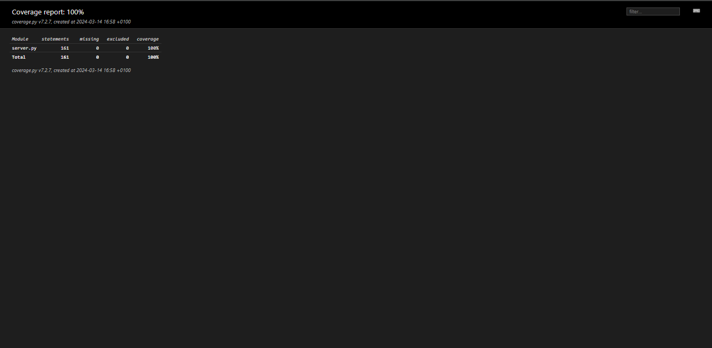

    

<div id="top"></div>

## Menu   
1. **[Informations générales](#informations-générales)**   
2. **[Fonctionnalitées](#fonctionnalitées)**   
3. **[Liste pré-requis](#liste-pre-requis)**   
4. **[Création environnement](#creation-environnement)**   
5. **[Activation environnement](#activation-environnement)**   
6. **[Installation des librairies](#installation-librairies)**   
7. **[Exécution de l'application](#execution-application)**   
8. **[Tests et couverture de code](#tests-et-couverture-de-code)**   
9. **[Tests unitaires](#tests-unitaires)**   
10. **[Tests d'intégrations](#tests-integrations)**   
11. **[Tests fonctionels](#tests-fonctionels)**   
12. **[Tests de performances avec Locust](#tests-performances)**   
13. **[Tests de couverture de code avec Coverage](#tests-coverage)**
14. **[Rapport avec flake8](#rapport-flake8)**   
15. **[Informations importantes sur les différents fichiers et dossiers](#informations-importantes)**   
16. **[Auteur et contact](#auteur-contact)**   


<div id="informations-générales"></div>

### Projet Gudlft   

- Application destinée à la réservation d'événements sportifs.   
- L'objectif de ce projet est d'apporter des corrections aux fonctions existantes et d'implémenter de nouvelles fonctions.   
- Effectuer un processus de test avec Pytest et Locust.   

Plusieurs domaines de l'application **Gudlft** ont été améliorés à partir du projet forker et cloner à l'adresse suivante :   
&rarr; [Python_Testing](https://github.com/OpenClassrooms-Student-Center/Python_Testing)   

--------------------------------------------------------------------------------------------------------------------------------

__Correction des erreurs__   

   - ``ERROR:`` Entering a unknown email crashes the app   
   - ``BUG:`` Clubs should not be able to use more than their points allowed   
   - ``BUG:`` Clubs shouldn't be able to book more than 12 places per competition   
   - ``BUG:`` Booking places in past competitions   
   - ``BUG:`` Point updates are not reflected   
   - ``FEATURE:`` Implement Points Display Board   

__Amélioration des fonctionnalités__   

  ```python
  def loadClubs():
  def loadCompetitions():
  def index():
  def showSummary():
  def book():
  def purchasePlaces():
  ```

__Création des fonctionnalités__   

  ```python
  def load_mock_clubs():
  def load_mock_competitions():
  def display_points_clubs():
  ```
--------------------------------------------------------------------------------------------------------------------------------

<div id="fonctionnalitées"></div>
<a href="#top" style="float: right;">Retour en haut ↑</a>

### Fonctionnalitées   

- Opérations de réservation pour les événements disponibles sur l'application.   
- Visualisation des clubs et du nombre de points.   

>_Testé sous Windows 10 Professionnel - Python 3.12.0 - Flask 3.0.0_   

--------------------------------------------------------------------------------------------------------------------------------

<div id="liste-pre-requis"></div>
<a href="#top" style="float: right;">Retour en haut ↑</a>

### Liste pré-requis   

- Interpréteur Python, version 3.7 ou supérieure   

Programme élaboré avec les logiciels suivants:   
- Python v3.12.0 choisissez la version adaptée à votre ordinateur et système. Python est disponible à l'adresse suivante &rarr; https://www.python.org/downloads/   
- Windows 10 Professionnel   

- Les scripts python s'exécutent depuis un terminal.   
- Pour ouvrir un terminal sur Windows, pressez la touche ``windows + r`` et entrez ``cmd``.   
- Sur Mac, pressez la touche ``command + espace`` et entrez ``terminal``.   
- Sur Linux, vous pouvez ouviri un terminal en pressant les touches ``Ctrl + Alt + T``.   

--------------------------------------------------------------------------------------------------------------------------------

<div id="creation-environnement"></div>
<a href="#top" style="float: right;">Retour en haut ↑</a>

### Création de l'environnement virtuel   

- Installer une version de Python compatible pour votre ordinateur.   
- Une fois installer ouvrer le cmd (terminal) placer vous dans le dossier principal (dossier racine).   

*Taper dans votre terminal :*    

```bash
$ python -m venv env
```
Un répertoire appelé "env" doit être créé.   


<div id="activation-environnement"></div>
<a href="#top" style="float: right;">Retour en haut ↑</a>

### Activation de l'environnement virtuel   

- Placez-vous avec le terminal dans le dossier principale (dossier racine).   

*Pour activer l'environnement virtuel créé, il vous suffit de taper dans votre terminal :*   
```bash
$ env\Scripts\activate.bat
```
- Ce qui ajoutera à chaque début de ligne de commande de votre terminal (env) :   
*Pour désactiver l'environnement virtuel, il suffit de taper dans votre terminal :*   

```bash
$ deactivate
```
--------------------------------------------------------------------------------------------------------------------------------

<div id="installation-librairies"></div>
<a href="#top" style="float: right;">Retour en haut ↑</a>

### Installation des librairies   

- Le programme utilise plusieurs librairies externes et modules de Python, qui sont répertoriés dans le fichier ``requirements.txt``.   
- Placez-vous dans le dossier où se trouve le fichier requirements.txt avec le terminal, l'environnement virtuel doit être activé.   
- Pour faire fonctionner le programme, il vous faudra installer les librairies requises.   
- À l'aide du fichiers requirements.txt mis à disposition.   

*Taper dans votre terminal la commande :*   

```bash
$ pip install -r requirements.txt
```

<div id="execution-application"></div>
<a href="#top" style="float: right;">Retour en haut ↑</a>

### Exécution de l'application   

#### Utilisation   

Lancement du serveur [**Flask**](https://flask.palletsprojects.com/en/3.0.x/).   
- Placez-vous avec le terminal dans le dossier principal.   
- Activer l'environnement virtuel et ensuite lancer le serveur Flask.   

*Taper dans votre terminal la commande :*   

```bash
$ set FLASK_APP=server.py
```
```bash
$ flask run
```

Lancement de l'application dans le navigateur de votre choix.   
Se rendre à l'adresse. &rarr; http://127.0.0.1:5000/   

*Navigateur*   
>*Note : Les tests ont était fait sur Firefox et Google Chrome.*   

--------------------------------------------------------------------------------------------------------------------------------

<div id="tests-et-couverture-de-code"></div>
<a href="#top" style="float: right;">Retour en haut ↑</a>

### Tests et couverture de code   

- Nous effectuons des tests de plusieurs manières pour garantir la qualité de notre code.   

>*Note : Pour exécuter les tests il est nécessaire d'avoir activer l'environnement virtuel, mais il n'est pas nécessaire de lancer le serveur Flask.*    

##### Exécution de Pytest   

- Pour exécuter les tests à l'aide de [**Pytest**](https://docs.pytest.org/), utilisez la commande suivante :   

```bash
$ pytest -v
```
```bash
tests\functional_tests\test_server_functional.py                                              [12%]
tests\integration_tests\test_server_points_table.py                                           [15%]
tests\integration_tests\test_server_purchase_places.py                                        [47%]
tests\unitary_tests\test_server_book.py                                                       [52%]
tests\unitary_tests\test_server_execption.py                                                  [67%]
tests\unitary_tests\test_server_loading_json.py                                               [85%]
tests\unitary_tests\test_server_login.py                                                     [100%]

================================== 40 passed in 85.75s (0:01:25) ==================================
``` 

--------------------------------------------------------------------------------------------------------------------------------

<div id="tests-unitaires"></div>
<a href="#top" style="float: right;">Retour en haut ↑</a>

#### Tests unitaires   
- Les tests unitaires sont générés et exécutés grâce au module [**Pytest**](https://docs.pytest.org/).   
- Ils sont situés dans le dossier ``tests/unitary_tests/`` &rarr; ([unitary_tests](tests/unitary_tests)).   
  - ``test_server_book.py``   
  - ``test_server_exception.py``   
  - ``test_server_loading_json.py``   
  - ``test_server_login.py``   

--------------------------------------------------------------------------------------------------------------------------------

<div id="tests-integrations"></div>
<a href="#top" style="float: right;">Retour en haut ↑</a>

#### Tests d'intégrations   
- Les tests d'intégrations sont générés et exécutés grâce au module [**Pytest**](https://docs.pytest.org/).   
- Ils sont situés dans le dossier ``tests/integration_tests/`` &rarr; ([integration_tests](tests/integration_tests)).   
  - ``test_server_points_table.py``   
  - ``test_server_purchase_places.py``   

--------------------------------------------------------------------------------------------------------------------------------

<div id="tests-fonctionels"></div>
<a href="#top" style="float: right;">Retour en haut ↑</a>

#### Tests fonctionels   
- Les tests fonctionels sont générés et exécutés grâce au module [**Selenium**](https://selenium-python.readthedocs.io/).   
- Ils sont situés dans le dossier ``tests/functionnal_tests/`` &rarr; ([functional_tests](tests/functional_tests/)).   
  - ``test_server_functional.py``   

Les tests vérifient le fonctionnement du serveur, la navigation sur les pages, la saisie de données, et la validation de l'affichage.   
Chaque méthode de test est conçue pour tester un aspect spécifique de l'application.   
- Les tests sont les suivants :   

```python
1. def test_home_page(): 
# Vérifie que la page d'accueil s'affiche correctement et contient le titre attendu.   
```

```python
2. def test_display_points_table_clubs():
# Vérifie que la page "View clubs points" s'affiche correctement
# et affiche le message "Points available by clubs". 
```  

```python
3. def test_login_user():
# Test le processus de connexion de l'utilisateur
# et vérifie que la page de bienvenue affiche l'adresse e-mail de l'utilisateur connecté.   
```

```python
4. def test_book_places_reservation_success():
# Teste le processus de réservation de places pour une compétition.
# Il simule la sélection de places, la réservation et vérifie le message de confirmation.   
```

```python
5. def test_book_places_reservation_success():
# Teste le processus de réservation de places pour une compétition.
# Il simule la sélection de places, la réservation et vérifie le message de confirmation.
# Ensuite, le test vérifie que les points disponibles sont mis à jour
# conformément à la réservation effectuée et que le nombre
# de places disponibles pour cette compétition est correctement réduit.   
```

```python
6. def test_logout():
# Teste le processus de déconnexion de l'utilisateur et vérifie que l'utilisateur est redirigé
# vers la page de connexion.   
```
--------------------------------------------------------------------------------------------------------------------------------

<div id="tests-performances"></div>
<a href="#top" style="float: right;">Retour en haut ↑</a>

#### Tests de performances avec Locust   
- Les tests de performances sont générés et exécutés grâce au module [**Locust**](https://locust.io/).   
- Ils sont situés dans le dossier ``tests/performance_tests/`` &rarr; ([performance_tests](tests/performance_tests/)).   
  - ``locustfile.py``   

- Lancer le serveur de test de performance :   
```bash
$ locust -f tests\performance_tests\locustfile.py
```
- Se rendre sur l'adresse : [http://localhost:8089/](http://localhost:8089/)   
- Choisir les options et lancer les tests.   

Sur cette page, vous devez préciser :   

- **Number of total users to simulate** : le nombre total d'utilisateurs à simuler.   
- **Spawn rate** : le taux de création d'utilisateurs, il correspond au nombre d’utilisateurs créés par seconde jusqu’à atteindre le nombre total d’utilisateurs.   
- **Host** : l’adresse de l'application, dans notre cas http://127.0.0.1:5000/ l’application est lancée sur le localhost.   

**Page de connexion Locust**   

   

**Rapport Locust**   

   

|Type    |Name                        | # reqs|     # fails |    Avg|    Min|    Max|   Med |   req/s| failures/s|
|--------|----------------------------|-------|-------------|-------|-------|-------|-------|--------|-----------|
|GET     |.index                      |     10|    0(0.00%) |     79|     23|    123|    62 |    0.30|       0.00|
|POST    |.showSummary                |     10|    0(0.00%) |     47|     23|    116|    33 |    0.30|       0.00|
|GET     |//                          |    559|    0(0.00%) |    120|     13|    220|   120 |   16.63|       0.00|
|GET     |//logout                    |    528|    0(0.00%) |    118|     14|    218|   120 |   15.71|       0.00|
|POST    |//purchasePlaces            |    585|    0(0.00%) |     63|      7|    164|    63 |   17.40|       0.00|
|POST    |//showSummary               |    635|    0(0.00%) |     63|      8|    160|    63 |   18.89|       0.00|
|GET     |/logout                     |     10|    0(0.00%) |    101|     84|    109|   109 |    0.30|       0.00|
|GET     |book                        |    545|    0(0.00%) |     60|      6|    163|    61 |   16.21|       0.00|
|GET     |display_points_clubs        |    578|    0(0.00%) |     60|      5|    161|    61 |   17.19|       0.00|

    Aggregated                     3460      0(0.00%)    80      5      220    69      102.93   0.00


Response time percentiles (approximated)
|Type    |Name                        |     50%|   66%|   75%|   80%|   90%|   95%|   98%|   99%| 99.9%|99.99%|  100%|# reqs|
|--------|----------------------------|--------|------|------|------|------|------|------|------|------|------|------|------|
|GET     |.index                      |      80|   100|   120|   120|   120|   120|   120|   120|   120|   120|   120|    10|
|POST    |.showSummary                |      42|    47|    55|    65|   120|   120|   120|   120|   120|   120|   120|    10|
|GET     |//                          |     120|   130|   140|   140|   160|   170|   190|   200|   220|   220|   220|   559|
|GET     |//logout                    |     120|   130|   140|   140|   160|   180|   200|   200|   220|   220|   220|   528|
|POST    |//purchasePlaces            |      63|    69|    73|    75|    84|    92|   100|   120|   160|   160|   160|   585|
|POST    |//showSummary               |      63|    69|    73|    76|    87|    94|   100|   120|   160|   160|   160|   635|
|GET     |/logout                     |     110|   110|   110|   110|   110|   110|   110|   110|   110|   110|   110|    10|
|GET     |book                        |      61|    66|    71|    73|    82|    89|   100|   110|   160|   160|   160|   545|
|GET     |display_points_clubs        |      61|    67|    71|    74|    83|    93|   100|   110|   160|   160|   160|   578|

    Aggregated                     69      85     100       110     130     150     170    190     220      220      220    3460

--------------------------------------------------------------------------------------------------------------------------------

<div id="tests-coverage"></div>
<a href="#top" style="float: right;">Retour en haut ↑</a>

#### Tests de couverture de code avec Coverage   

- Utilisation de [Coverage](https://coverage.readthedocs.io/en/7.3.2/) pour mesurer la couverture de code.   

- Cette commande exécute les tests en utilisant Coverage pour collecter les informations de couverture.   
```bash
$ pytest --cov=.
```
```bash
tests\functional_tests\test_server_functional.py                                              [12%]
tests\integration_tests\test_server_points_table.py                                           [15%]
tests\integration_tests\test_server_purchase_places.py                                        [47%]
tests\unitary_tests\test_server_book.py                                                       [52%]
tests\unitary_tests\test_server_execption.py                                                  [67%]
tests\unitary_tests\test_server_loading_json.py                                               [85%]
tests\unitary_tests\test_server_login.py                                                     [100%]

================================== 40 passed in 85.75s (0:01:25) ==================================

----------- coverage: platform win32, python 3.12.0-final-0 -----------
Name        Stmts   Miss  Cover
-------------------------------
server.py     143      0   100%
-------------------------------
TOTAL         143      0   100%


============================================= 40 passed in 86.40s (0:01:26) =======================
```
*Renvoie* : **100%** de couverture de code.   

- Pour afficher un rapport de couverture avec plus de détails.   

```bash
$ pytest --cov=. --cov-report html
```

- Cela générera un dossier ``htmlcov`` dans lequel vous pouvez ouvrir le fichier ``index.html`` pour visualiser un rapport interactif de la couverture de code dans votre navigateur.   

**Rapport Coverage**   

   

--------------------------------------------------------------------------------------------------------------------------------

<div id="rapport-flake8"></div>
<a href="#top" style="float: right;">Retour en haut ↑</a>

### Rapport avec flake8   

*Tapez dans votre terminal la commande :*   

```bash
$ flake8
```
- *Ne renvoie aucune erreur.*   

--------------------------------------------------------------------------------------------------------------------------------

<div id="informations-importantes"></div>
<a href="#top" style="float: right;">Retour en haut ↑</a>

### Informations importantes sur les différents fichiers et dossiers   

**Le dossier tests**   
  - Contient 4 dossiers contenant les fichiers de configuration pour les tests. &rarr; ([tests](tests))   
    - ``functional_tests``   
    - ``integration_tests``   
    - ``performance_tests``   
    - ``unitary_tests``   

**Le dossier templates**   
  - Le dossir contient toute la configuration des pages ``html`` ([templates](templates))   

**Le dossier static**   
- Dossier qui contient qui contient les images svg des badges et le dossier ``css`` ([css](static/css)) nécessaire à l'application.   

**Le fichier .coveragerc**   
  - Le fichier contient la configuration de ``Coverage`` ([.coveragerc](.coveragerc))   


<div id="auteur-contact"></div>
<a href="#top" style="float: right;">Retour en haut ↑</a>

#### Auteur et contact   

Pour toute information suplémentaire, vous pouvez me contacter.   
**Bubhux:** bubhuxpaindepice@gmail.com   
